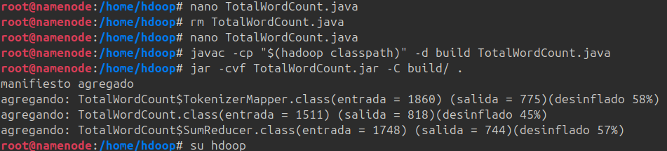
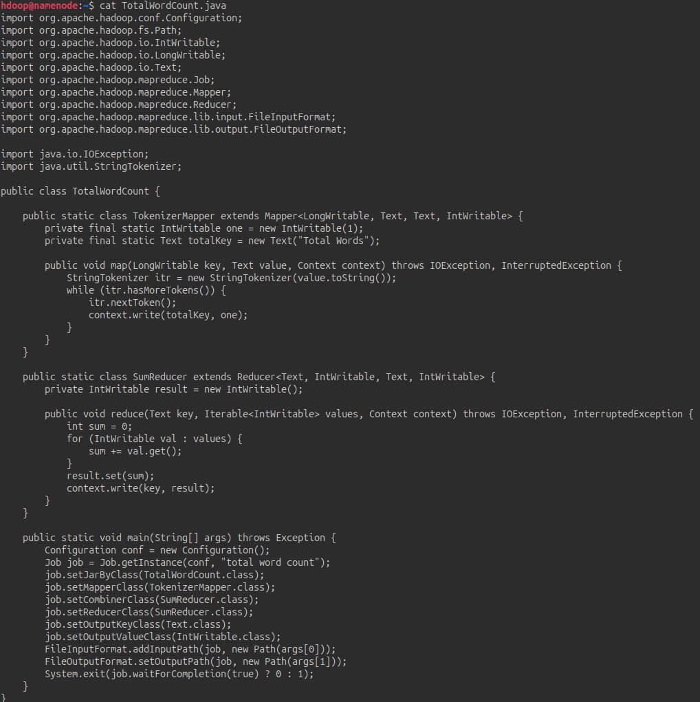
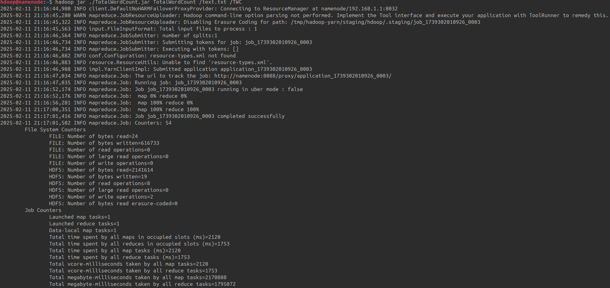
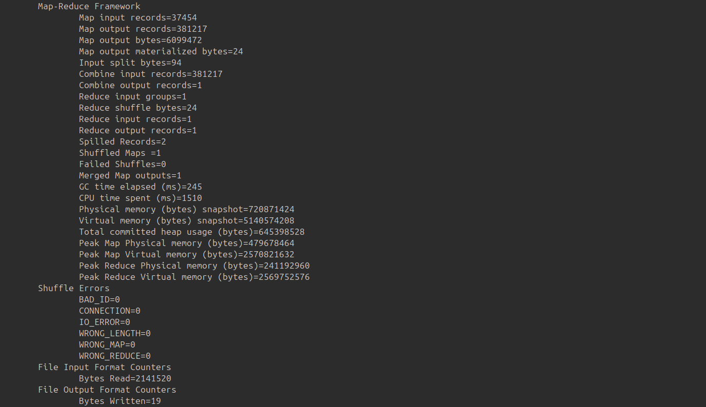
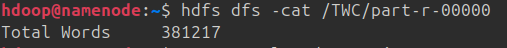

# Creaccion de archivo ejecutable

Mi programa es un contador de palabras totales. Aqui la creaccion del archivo .java y del .jar

El codigo es el siguiente:

Ejecución del contador total de palabras:

Comprobación:

