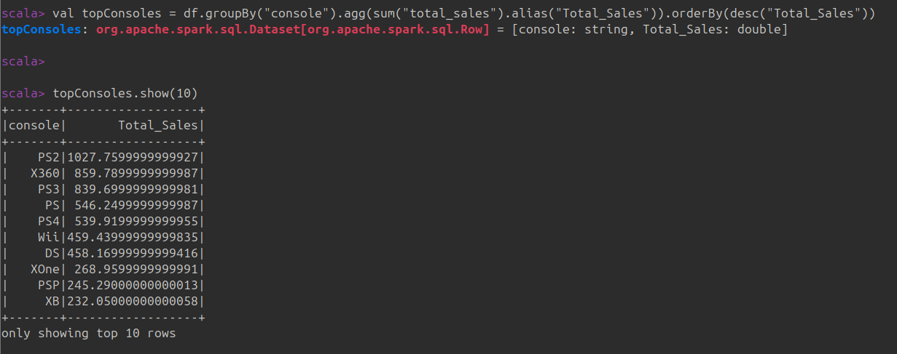

# Analisis basico de un archivo .csv con pyspark

## Introduccion

He decido escoger el dataset de kaggle de ventas de videojugos ([https://www.kaggle.com/datasets/hosammhmdali/video-game-sales-2024?resource=download](https://)) donde se muestras las ventas e informacion de videojugos.

## Primeros pasos

![1740427810658]

## Juegos con mas ventas (sumando todas las consolas)

## Consolas con más juegos vendidos (suma de ventas por consola)

## Géneros más populares de 2018 (el de más ventas en ese año)

