# **HDFS CLUSTER**

## **Parte de preparacion del nodo**

IPs y nombres de los hosts

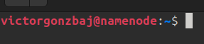

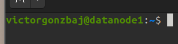

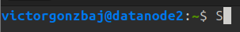

Versión Java

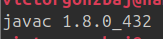

Fichero authorizes-keys de todos los hosts

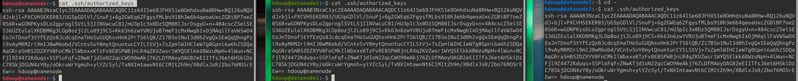

lsblk de los nodos

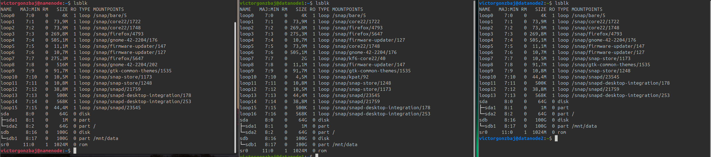

## **Configuracion de Hadoop**

Ver variables HADOOP_HOME y PATH del namenode

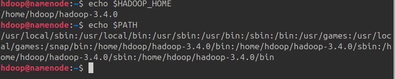

Configuración del archivo core-site.xml en cada nodo.

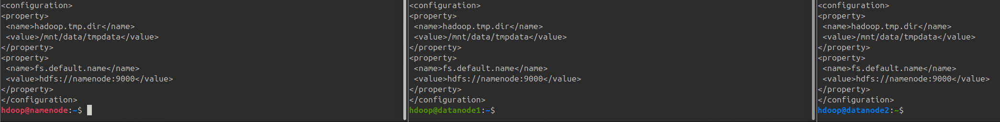

## **Namenode sin ser datanode**

Configuración del archivo hdfs-site.xml en cada nodo.

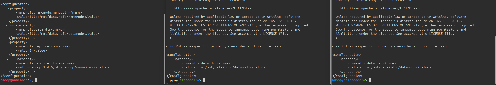

Información del sistema hdfs, espacio disponible

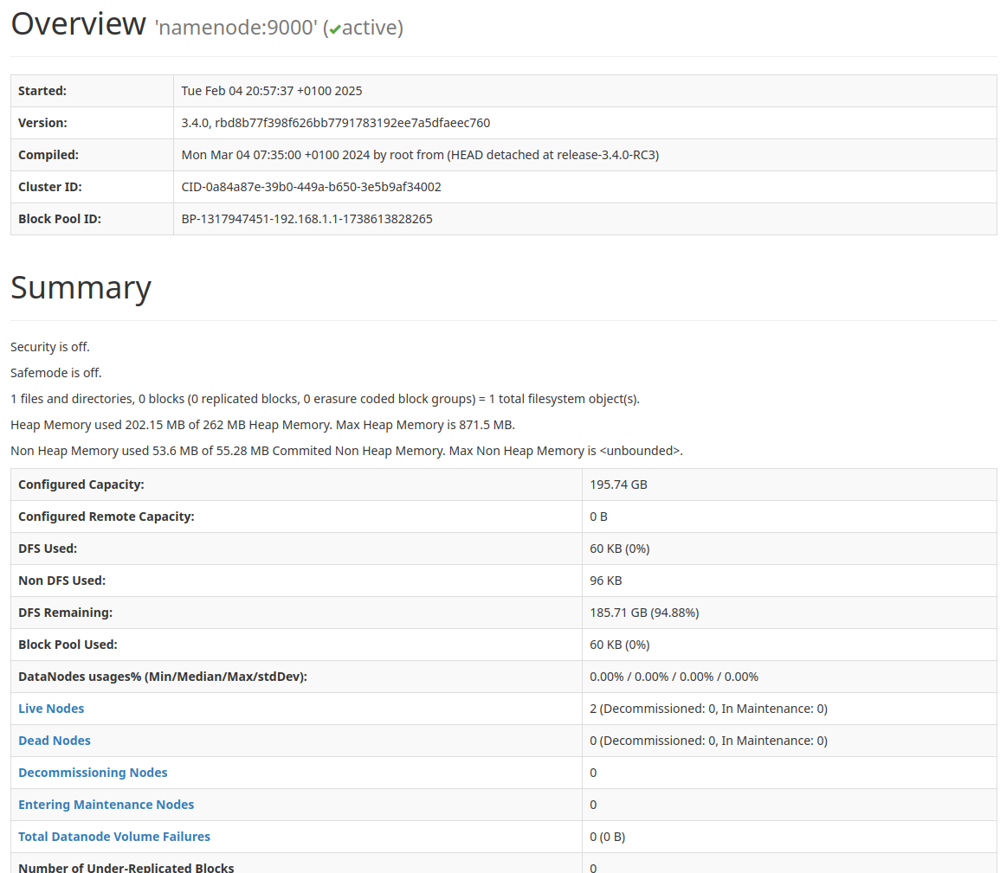

Crear algunas carpetas y subir algún fichero grande a alguna de ellas

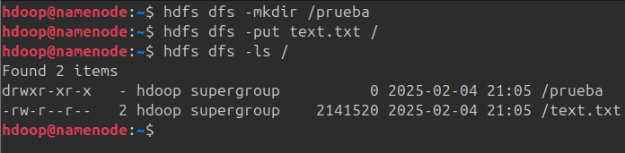

Mostrar la estructura y algún fichero con bloques replicados y en que nodos están

## **Namenode siendo datanode**

Mostrar archivo hdfs-site.xml de ese hosts. Mostrar archivo Workers.

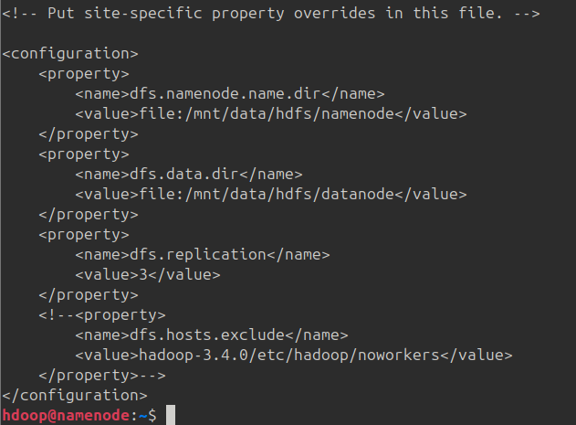

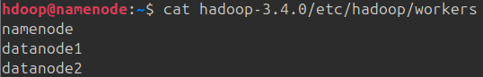

Eliminar el fichero de antes y volverlo a subir

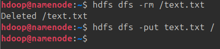

Mostrar de nuevo en un navegador los nodos activos y los bloques que ocupa el fichero

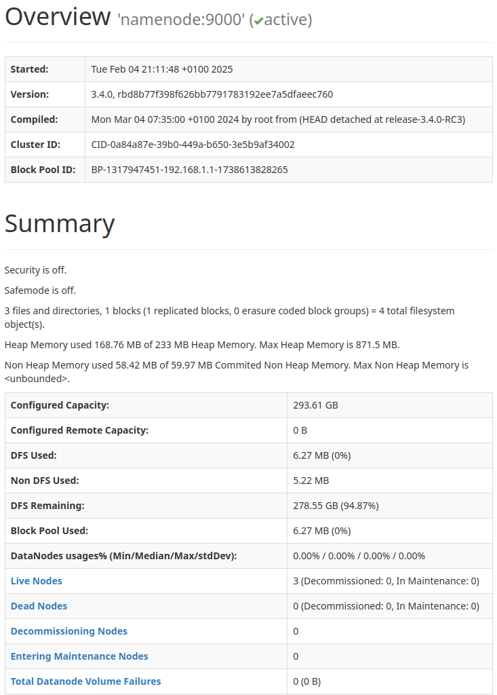

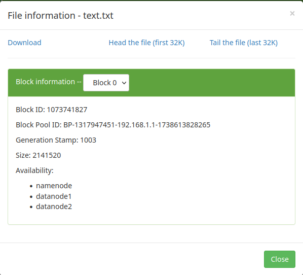

Modificar hdfs-site.xml para disminuir el tiempo de latencia de comprobación de nodos activos y mostrar esa configuración

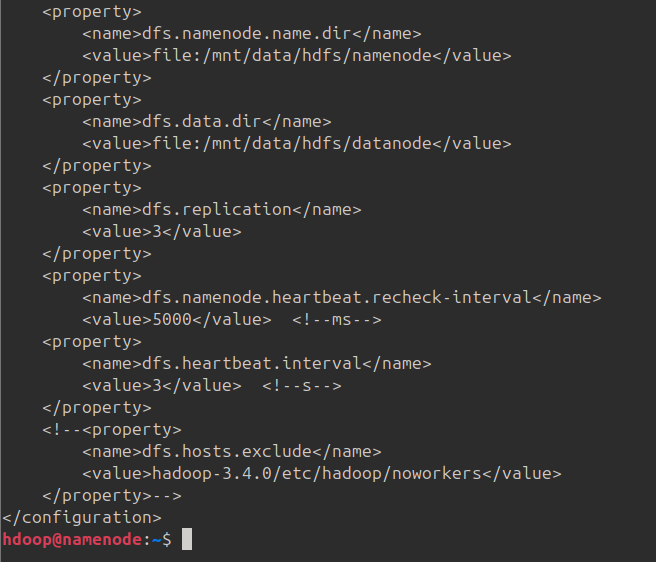

Decomisar un host que no sea el namenode

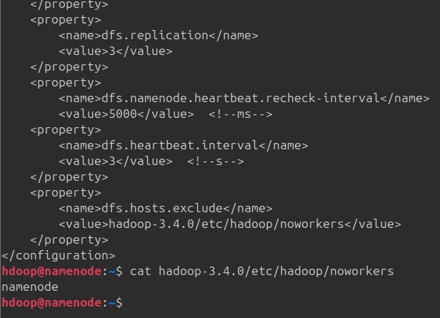

Mostrar en el navegador la nueva situación y como ha replicado los bloques de nuevos

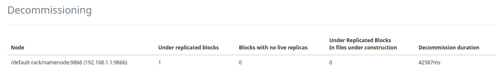

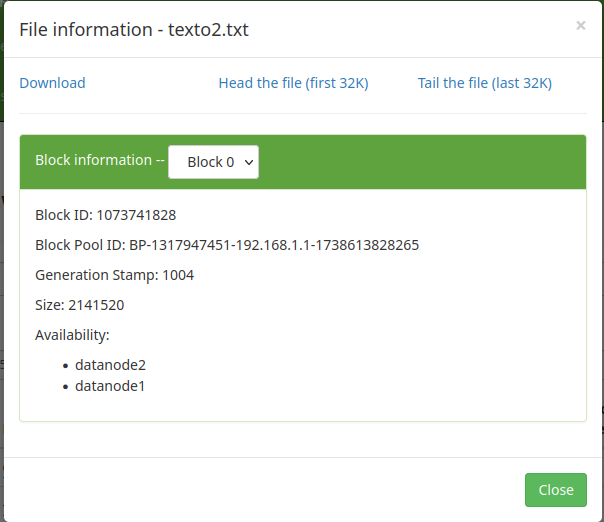
