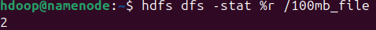

# Guía para Instalar Hadoop en Linux 24.04.1 (Un Namenode y Dos Datanodes)

## Requisitos Previos

1. **Tres Equipos Linux 24.04.1:**
   - Un Namenode
   - Dos Datanodes
2. **Java 8 instalado:**
3. **Conexión de red entre los tres equipos.** He usado redinterna para interconexionar los equipos
   - datanode: 192.168.1.1
   - datanode1: 192.168.1.2
   - datanode2: 192.168.1.3

## Paso 1: Configurar los Nombres de Host y el Archivo `/etc/hosts`

En cada equipo, edita el archivo `/etc/hosts` para que puedan resolver los nombres:

```bash
sudo nano /etc/hosts
```

Agrega las siguientes entradas (ajustando las IPs y nombres de host):

```
192.168.1.1 namenode
192.168.1.2 datanode1
192.168.1.3 datanode2
```

Guarda y cierra el archivo.

## Paso 2: Instalar Java

En cada equipo, instala Java:

```bash
sudo apt update
sudo apt install openjdk-8-jdk -y
```

Verifica la versión:

```bash
java -version
```

## Paso 3: Crear Usuario para Hadoop

Crea un usuario dedicado para Hadoop en cada equipo:

```bash
sudo adduser hadoop
sudo usermod -aG sudo hadoop
```

Inicia sesión como el usuario `hadoop`:

```bash
su - hadoop
```

## Paso 4: Descargar e Instalar Hadoop

Descarga Hadoop en cada equipo:

```bash
wget https://downloads.apache.org/hadoop/common/hadoop-3.4.0/hadoop-3.4.0.tar.gz
```

Extrae los archivos:

```bash
tar -xvzf hadoop-3.4.0.tar.gz
```

Configura las variables de entorno editando `~/.bashrc`:

```bash
nano ~/.bashrc
```

Agrega lo siguiente:

```bash
export HADOOP_HOME=/home/hdoop/hadoop-3.4.0
export HADOOP_INSTALL=$HADOOP_HOME
export HADOOP_MAPRED_HOME=$HADOOP_HOME
export HADOOP_COMMON_HOME=$HADOOP_HOME
export HADOOP_HDFS_HOME=$HADOOP_HOME
export YARN_HOME=$HADOOP_HOME
export PATH=$PATH:$HADOOP_HOME/bin:$HADOOP_HOME/sbin
```

Aplica los cambios:

```bash
source ~/.bashrc
```

## Paso 5: Configurar Hadoop

Edita los archivos de configuración en todos los equipo excepto que indique lo contrario:

### Archivo `core-site.xml`

Ubicación: `$HADOOP_HOME/etc/hadoop/core-site.xml`

```xml
<configuration>
    <property>
        <name>fs.defaultFS</name>
        <value>hdfs://namenode:9000</value>
    </property>
</configuration>
```

### Archivo `hadoop-env.sh`

Ubicación: `$HADOOP_HOME/c/hadoop/hadoop-env.sh`
Descomenta la variable $JAVA_HOME y modificala:

```bash
export JAVA_HOME=/usr/lib/jvm/java-11-openjdk-amd64
```

### Archivo `hdfs-site.xml`

Ubicación: `$HADOOP_HOME/etc/hadoop/hdfs-site.xml`

#### En el Namenode:

```xml
<configuration>
    <property>
        <name>dfs.replication</name>
        <value>2</value>
    </property>
    <property>
        <name>dfs.namenode.name.dir</name>
        <value>file:/home/hdoop/hdfs/namenode</value>
    </property>
</configuration>
```

#### En cada Datanode:

```xml
<configuration>
    <property>
        <name>dfs.data.dir</name>
        <value>file:/home/hdoop/hdfs/datanode</value>
    </property>
</configuration>
```

### Archivo `mapred-site.xml`

Ubicación: `$HADOOP_HOME/etc/hadoop/mapred-site.xml`

Edita el archivo:

```xml
<configuration>
    <property>
        <name>mapreduce.framework.name</name>
        <value>yarn</value>
    </property>
</configuration>
```

### Archivo `yarn-site.xml`

Ubicación: `$HADOOP_HOME/etc/hadoop/yarn-site.xml`

```xml
<configuration>
    <property>
        <name>yarn.resourcemanager.hostname</name>
        <value>namenode</value>
    </property>
    <property>
        <name>yarn.nodemanager.aux-services</name>
        <value>mapreduce_shuffle</value>
    </property>
</configuration>
```

### Archivo `workers`

Ubicación: `$HADOOP_HOME/etc/hadoop/workers`

```txt
datanode1
datanode2
```

## Paso 6: Formatear el Namenode

Solo en el Namenode:

```bash
hdfs namenode -format
```

## Paso 7: Iniciar los Servicios

### Namenode:

```bash
start-dfs.sh
start-yarn.sh
```

### Verificar Servicios:

Accede a las siguientes URLs:

- Namenode: `http://namenode:9870`
- ResourceManager: `http://namenode:8088`

```bash
hdfs dfsadmin -report
```

## Paso : Probar el Cluster

Crea un directorio en HDFS:

```bash
hdfs dfs -mkdir /test
hdfs dfs -ls /
```

Crea un archivo de 100MB:

```bash
truncate -s 100M 100mb_file
```

Subelo a HDFS:

```bash
hdsf dfs -put 100mb_file /
```

Comprueba la replicacion del archivo:

```bash
hdfs dfs -stat %r /100mb_file
```

Resultado:



Esto quiere decir que el archivo esta replicado 2 veces.
